# Prismarine - your partner in General Chemistry

--- 

🚀 Deployment Link: https://deadbush225.github.io/Prismarine/

⚙ Technology Stack:
  - TypeScript
  - SASS
  - WebPack
  - Git & GitHub

---

🧔 Leader: **Inso**, Eliazar N.

👩 Members:

1. **Abrea**, Maureen I.
2. **Andrade**, Athena Jannelle S.
3. **Austero**, Jasmine C.
4. **Estrologo**, Aliah Gwen D.
5. **Lugagay**, Samantha B.
6. **Manuel**, Micah Danielle F.
7. **Sabordo**, Je-Anne B.
8. **Sebastian**, Rhian Kaye S.

---

#### UNIQUE FEATURES:

+ **Live intractability** to the atoms with the **Interactive Periodic Table**
+ **Mobile Friendly**, even the **Interactive Periodic Table**
+ **Theme** switcher to **Dark Mode** and **Light Mode**
+ **Fast** and **Efficient,** since it is not embedded which is noticeable to other platforms such as Adobe XD

#### DEVELOPER NOTES:

+ When **hovering** over a picture in the **Teams** Tab will show the name of the member
+ When **hovering** over **Electron|Neutron|Proton** in the Atomic Model will **highlight the sub-atomic particle**
+ The **references** can be seen in the **bottom right section of the home page**

#### TO FUTURE DEVELOPER:

+ **Since this website will be open source,** it will be fully replicatable and anyone can extend and add additional functionalities to this. The code used is **organized and sorted using a known programming conventions**, so others will save development time rebuilding from the start and focus on what functionality they deem to add.

+ This will match the aim of the project which is to build a sustainable and functional learning material that will help the future generations of students to come in their academics, especially in chemistry.

## Documentation:
### OUTLINE OF THE WEBSITE:

**By clicking the link,** you will see our main topics which are atomic structure and chemical bonding and below them are their different topics.

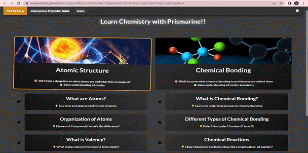

**On the top of the website**, three options will be visible to you: "STEM 11-6" (where our topics are situated), "Interactive Periodic Table" (where our interactive simulation of the periodic table is located), and "Team" (where the names of our group members who contributed to the creation of this website are listed).

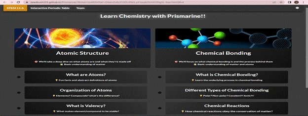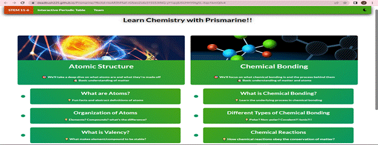

**First**, the Atomic Structure, we discussed different topics such as atoms, organization of atoms, and valency.

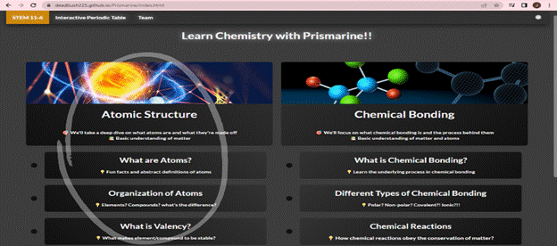

**Second**, when you click the "What are Atoms?", it will show the definition of atoms and the definition of the three parts of an atom. This will show if the charges are positive, negative, or even neutral, and if their size is small or not. Lastly, is the location, whether they are located inside or outside the nucleus.

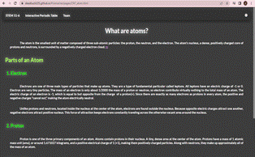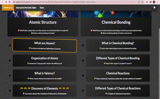

**Third**, under the atomic structure is the **Organization of Atoms**. This is where we discussed the definition of elements, the difference between elements and atoms, the definition of compounds, and the difference between compounds and elements.

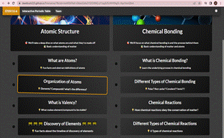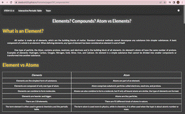

**Fourth**, once you click **What is Valency?**, it will direct to the discussion of definition and examples of valence electrons. We also include the process in which you will find the valence electrons and how many valence electrons they have in a group of elements.

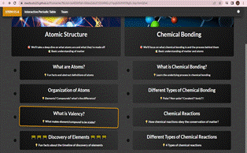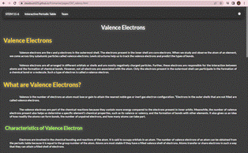

**Fifth,** the Chemical Bonding, we discussed the different topics such as chemical bonding, different types of chemical bonding, chemical reaction, and different types of chemical reactions.

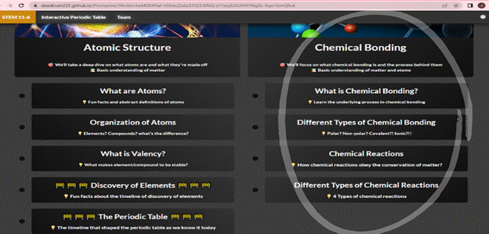

**Sixth,** when you click the "What is Chemical Bonding", it will show the definition of chemical bonding that we have discussed.

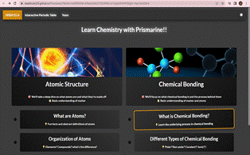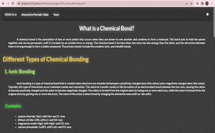

**Seventh,** we included the different types of chemical bonding such as Ionic Bonding, Covalent Bonding, and Metallic Bonding, together with their various properties and examples.

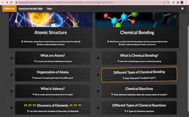

**Eighth**, under the chemical bonding is the chemical reactions in which we have discussed the definition of chemical reaction and its examples.

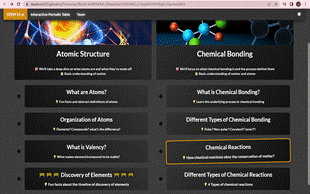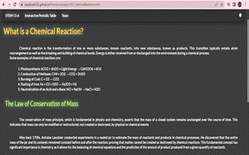

**Ninth**, we included the different types of chemical reactions such as Synthesis Reactions/Direct Combination Reactions, Double-Replacement Reactions or Salt Metathesis Reactions, Chemical Decomposition/Analysis Reactions, and Single Replacement or Substitution Reactions together with their examples.

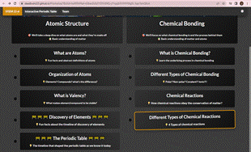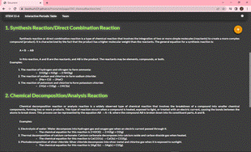

**On the bottom right of the website,** you will see the references to acknowledge the rightful authors work and to avoid plagiarism.

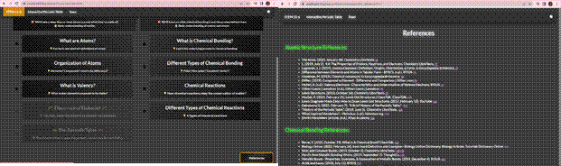

 
**Once you click the Interactive Periodic Table**, you will find the 118 elements. If you click on one element, it will show the graphics on the right side, which indicates the number of electrons, protons, and neutrons in each element. If you scroll down the website, it will show more information about the Interactive Periodic Table, such as its atomic mass, oxidation states, melting point, etc. And once you click the hyperlink at the bottom right of the website, it will lead you to another site for additional information.

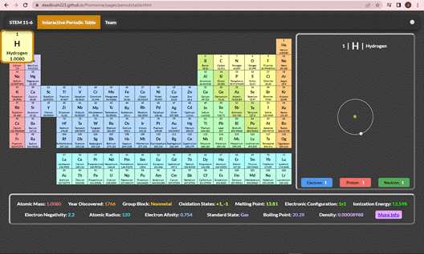

---
### Previews:

**Attach here is the screenshot of our website/web page (Desktop):**

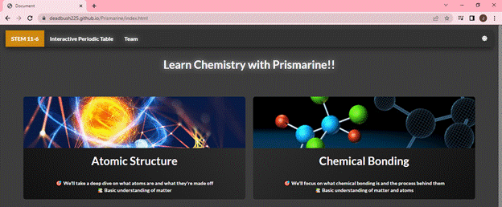

**Attached here is the screenshot of our website (Mobile):**

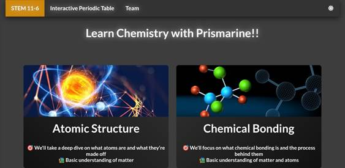

